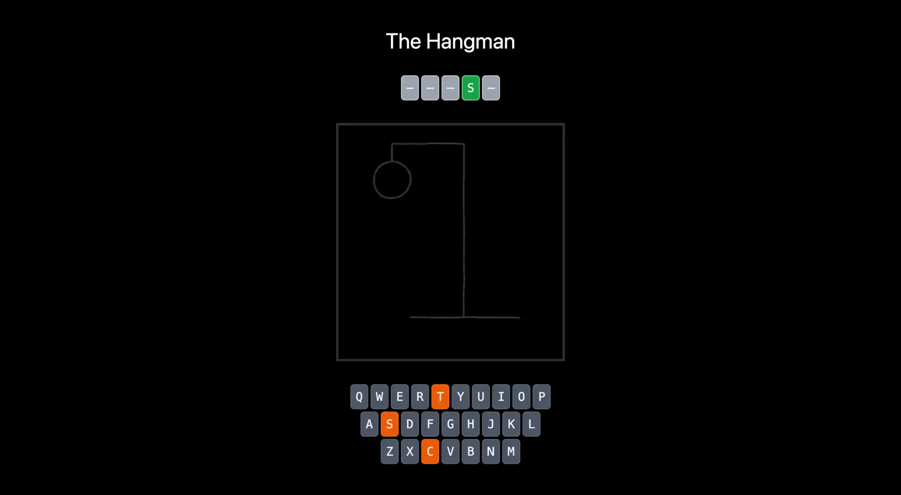

# The Hangman

Hangman is a classic word-guessing game that tests your vocabulary and spelling skills. Guess the hidden word by suggesting letters, and try to reveal the complete word before running out of attempts.

## Features

* Interactive Experience: Enjoy a simple, user-friendly interface that makes the game 
engaging and fun.

## Technologies

- **[Astro](https://astro.build/):** A framework for building fast, modern websites with ease.
- **[Vue](https://vuejs.org/):** A progressive JavaScript framework for building user interfaces.
- **[Tailwind CSS](https://tailwindcss.com/):** A utility-first CSS framework for creating customizable and modern user interfaces.

## Hosted on Vercel

This project is hosted on Vercel, a platform for deploying and hosting web 
applications. You can visit it here: [hangman.mpont91.com](https://hangmang.mpont91.com)

## Installation and Setup

To clone and run this application on your local environment, follow these steps:

1. **Clone the repository:**
   ```sh
    git clone https://github.com/yourusername/hangman.git
    cd hangman
    ```
2. **Install dependencies:**
   ```sh
   npm install
   ```
3. **Run the application:**
   ```sh
   npm run dev
   ```
4. **Visit in your browser:** 
Open http://localhost:3000 in your browser to see the 
   application in action.

## Contribution

Contributions are welcome! If you'd like to contribute to this project, please follow these steps:

1. **Fork the repository**
2. **Create a branch for your feature or bug fix (`git checkout -b feature/your-feature`)**
3. **Commit your changes (`git commit -am 'Add new feature'`)**
4. **Push to the branch (`git push origin feature/your-feature`)**
5. **Create a new Pull Request**

## License

This project is licensed under the MIT License.

## Contact

For questions or comments, you can reach me at [mpont91@gmail.com](mailto:mpont91@gmail.com)

---

Thank you for using Hangman! We hope you enjoy playing and challenging your vocabulary skills.